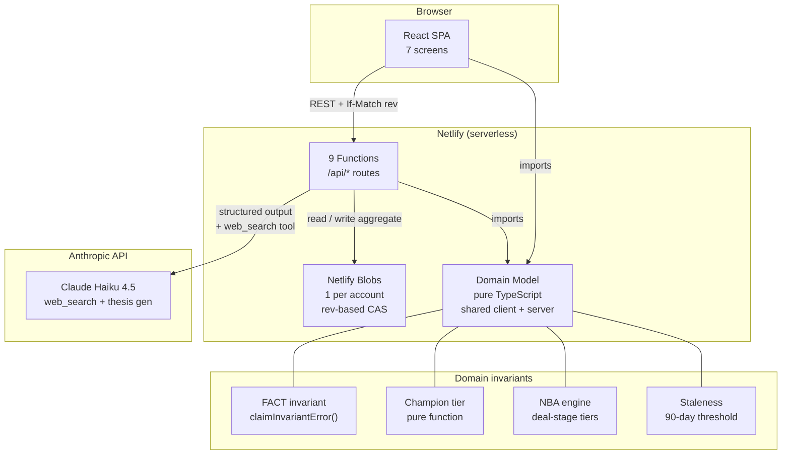
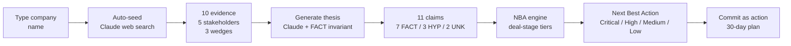

# Account Signal — Summary & Architecture

## What it is

Account Signal is an evidence-first execution system for enterprise sellers. It compresses 4 hours of account research into 30 seconds, forces evidence-based selling with a server-enforced FACT invariant, and gives a deterministic Next Best Action — so the seller spends time selling, not spreadsheeting.

## The 5 core ideas

1. **Evidence is the spine.** Everything in the system — claims, champion signals, wedges — must cite evidence. No citation, no FACT.

2. **FACT / HYPOTHESIS / UNKNOWN.** Every claim is labelled. The server enforces the invariant: a FACT needs a real citation, inference can't support a FACT, an UNKNOWN can't cite evidence. The LLM can propose claims, but the code has the final word.

3. **8-signal champion test.** A stakeholder's champion tier (Contact → Coach → Potential → Validated) is a pure function of evidenced signals — not gut feel. Cheapest-first ladder tells you the next test.

4. **Deterministic Next Best Action.** The NBA is computed from account state, not generated by an LLM. Tiers (Critical / High / Medium / Low) adapt to the deal stage (Discovery / Evaluation / Negotiation). The same candidate changes priority depending on where the deal is.

5. **Auto-seeding.** Type a company name → Claude's web search tool researches it in real time → 10 evidence items, 5 stakeholders, 3 wedges. The seller walks into a first meeting with a populated account plan.

## Architecture diagram

## Data flow

## Tech stack

| Layer | Technology |
|-------|-----------|
| Frontend | Vite + React + TypeScript, BrowserRouter, 7 screens |
| Backend | 9 Netlify Functions (serverless), declared routes via `config.path` |
| Storage | Netlify Blobs (key-value), 1 blob per account, rev-based CAS via `If-Match` |
| AI | Anthropic Claude Haiku 4.5 — web search (seeding) + structured output (thesis) |
| Domain | Pure TypeScript shared between client and server — 48 vitest tests |
| Deploy | Git push to GitHub → Netlify auto-deploy |

## The 9 serverless functions

| Function | Route | Purpose |
|----------|-------|---------|
| accounts | `/api/accounts` | CRUD with rev-based concurrency |
| evidence | `/api/accounts/:id/evidence` | Idempotent ingestion, claim demotion on delete |
| claims | `/api/accounts/:id/claims` | CRUD with server-side FACT invariant |
| stakeholders | `/api/accounts/:id/stakeholders` | CRUD with 8-role buyer map |
| signals | `/api/accounts/:id/signals` | Champion signal recording, evidence required |
| actions | `/api/accounts/:id/actions` | CRUD with status transitions |
| wedges | `/api/accounts/:id/wedges` | Use case lifecycle, disqualification with reason |
| thesis | `/api/accounts/:id/thesis/generate` | Claude thesis gen, server enforces invariant |
| seed | `/api/accounts/:id/seed` | Claude web search, auto-populate new accounts |

## The 7 screens

| Screen | Tab | What it shows |
|--------|-----|---------------|
| Command Center | — | Portfolio list with derived metrics, add account (auto-seeds) |
| Thesis | default | Claims grouped by category, FACT/HYP/UNKNOWN chips, generate button |
| Evidence Ledger | Evidence | Record form + filterable list, demotion-impact warning |
| Stakeholders | Stakeholders | 8-role grid, champion test panel, posture tracking |
| Wedges | Wedges | Use case lifecycle, disqualify with reason + evidence |
| Actions | Actions | NBA card with tier badge + deal stage, 30-day plan |
| Change Log | Change log | Append-only event history |

## Key design principle

The model's job is research (thesis generation, web search). The code's job is judgment (FACT invariant, champion tier, NBA, staleness). The AI can propose; the code verifies. This is what makes the system trustworthy — the seller can defend every claim with evidence, not vibes.
