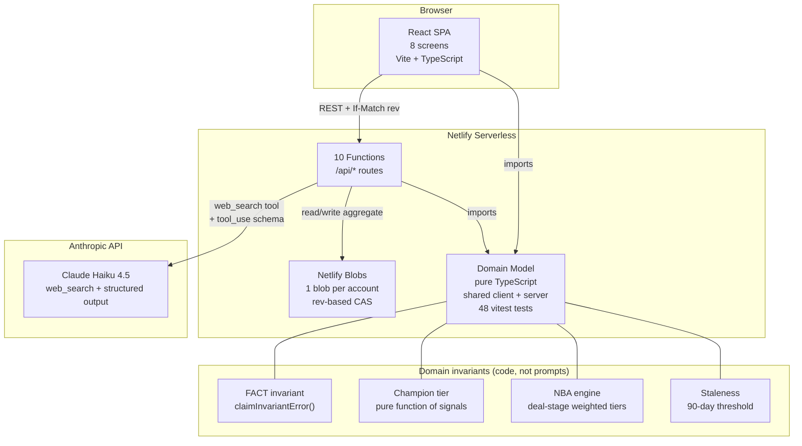
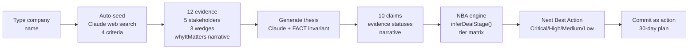

# Account Signal — Prototype Spec

## 1. What this prototype shows

Account Signal is an evidence-first execution system for enterprise sellers, deployed at **https://accountmapping.netlify.app/**. It compresses 4 hours of account research into 30 seconds and forces every claim to trace back to a real source.

### The live demo flow

**1. Type a company name.** The seller types "Vodafone" on the Command Center. Claude's web search tool researches the company in real time across 4 strategic criteria and auto-populates the account:

- **12 evidence items** (3 per criterion), each with a source link, verbatim quote, why it matters, implication for Factory, and the next discovery question
- **5 stakeholders** with buyer roles mapped (Economic Buyer, Champion, Technical Decision Maker, etc.)
- **3 wedges** — real engineering workloads where Factory could help
- **10 claims** — 4 category ratings, 1 thesis, 5 unknowns
- **A "Why this account matters" narrative** — a 2-3 sentence summary tying the 4 criteria together

**2. Open the Thesis tab.** The seller sees:

- **Top:** The "Why this account matters" narrative — why this account is strategically important, generated by Claude
- **Bottom:** Evidence grouped by the 4 strategic categories (Engineering Scale, Factory Fit, Urgency/Trigger, Right to Win), each with a rating chip (e.g., "ENGINEERING SCALE: VERY HIGH")
- Each evidence item has a **status dot** (Fact / Hypothesis / Unmarked) and buttons to **Mark as Fact**, **Mark as Hypothesis**, or **Remove**
- Clicking **Generate thesis** regenerates the narrative, evidence statuses, and claims from the evidence using Claude — with the server enforcing the FACT invariant

**3. Open the Evidence tab.** The seller can record new evidence (paste what was said, tag the source type, mark as confidential). Evidence is grouped by the 4 categories with analysis fields visible.

**4. Open the Stakeholders tab.** The seller sees an 8-role buyer map. For champion-track stakeholders, an **8-signal champion test** panel appears. Each signal must cite evidence — an unevidenced signal counts as UNKNOWN. The champion tier (Contact → Coach → Potential Champion → Validated Champion) is computed as a pure function of evidenced signals.

**5. Open the Wedges tab.** The seller tracks use cases through a lifecycle (Candidate → Testing → Validated → Disqualified). Disqualifying a wedge requires a reason and evidence.

**6. Open the Actions tab.** A **deterministic Next Best Action** engine shows ranked candidates with tier badges (Critical / High / Medium / Low) that adapt to the deal stage. The seller picks a candidate and commits it as an action with a concrete message and desired outcome.

### The 4 strategic qualification criteria

| Criterion | Question | What we search for |
|-----------|----------|-------------------|
| **Engineering Scale** | Does the account have enough engineering surface area? | Engineer headcount, tech spend, legacy systems, outsourcing footprint |
| **Factory Use-Case Fit** | Does the account have workloads that match Factory? | Legacy modernisation, cloud migration, developer productivity, platform engineering |
| **Urgency / Trigger** | Why would they act now? | New CTO appointment, cost reduction programme, migration deadline, AI strategy |
| **Right to Win** | Does Factory have a credible route to win? | Existing relationships, incumbent vendors, competitive position |

**Rule:** Right to Win cannot be rated High from public evidence alone — a High rating requires at least one validated internal signal.

### The FACT invariant

The system's core trust mechanism. Every claim is labelled FACT, HYPOTHESIS, or UNKNOWN. The server enforces:

- A **FACT** must cite at least one piece of evidence that is NOT an inference
- An **UNKNOWN** must cite nothing — if you have evidence, it's at least a HYPOTHESIS
- No claim may cite evidence that doesn't exist
- The LLM can propose claims, but the **code has the final word** — if Claude labels something FACT and the invariant doesn't hold, it's downgraded to HYPOTHESIS

---

## 2. Architectural diagram

### Data flow: from company name to next action

### Tech stack

| Layer | Technology |
|-------|-----------|
| Frontend | Vite + React 19 + TypeScript, BrowserRouter, 8 screens |
| Backend | 10 Netlify Functions (serverless), declared routes via `config.path` |
| Storage | Netlify Blobs (key-value), 1 blob per account, rev-based CAS via `If-Match` header |
| AI | Anthropic Claude Haiku 4.5 — `web_search_20250305` tool (seeding) + `tool_use` structured output (thesis) |
| Domain | Pure TypeScript shared between client and server — 48 vitest tests across 3 test files |
| Deploy | Git push to GitHub → Netlify auto-deploy (static + functions) |
| Concurrency | ETag compare-and-swap: every mutation sends `If-Match: "rev-N"`, stale writes return 409 |

### The 10 serverless functions

| Function | Route | Purpose |
|----------|-------|---------|
| accounts | `/api/accounts` | CRUD with rev-based concurrency |
| evidence | `/api/accounts/:id/evidence[/:eid]` | Idempotent ingestion, status updates, claim demotion on delete |
| claims | `/api/accounts/:id/claims[/:cid]` | CRUD with server-side FACT invariant enforcement |
| stakeholders | `/api/accounts/:id/stakeholders[/:sid]` | CRUD with 8-role buyer map |
| signals | `/api/accounts/:id/signals` | Champion signal recording, evidence required |
| actions | `/api/accounts/:id/actions[/:aid]` | CRUD with status transitions |
| wedges | `/api/accounts/:id/wedges[/:wid]` | Use case lifecycle, disqualification requires reason + evidence |
| thesis | `/api/accounts/:id/thesis/generate` | Claude thesis gen: narrative + evidence statuses + claims, server enforces invariant |
| seed | `/api/accounts/:id/seed` | Claude web search: 4-criteria research → evidence + claims + stakeholders + wedges |

### The 8 screens

| Screen | Tab | What it shows |
|--------|-----|---------------|
| Command Center | — | Portfolio list with derived metrics, add account (auto-seeds with spinner) |
| Thesis | default | "Why this account matters" narrative + evidence by 4 categories with Fact/Hypothesis/Remove |
| Evidence Ledger | Evidence | Record form + filterable list, grouped by category, demotion-impact warning |
| Stakeholders | Stakeholders | 8-role grid, champion test panel (gated to champion-track), posture tracking |
| Wedges | Wedges | Use case lifecycle, disqualify with reason + evidence |
| Actions | Actions | NBA card with tier badge + deal stage label, 30-day plan |
| Change Log | Change log | Append-only event history |

### Key design principle

**The model's job is research. The code's job is judgment.**

- Claude researches (web search, thesis generation) — but cannot override invariants
- The FACT invariant is enforced in TypeScript, not in prompts
- The champion tier is a pure function, not an LLM call
- The NBA is computed deterministically from account state, not generated
- Every mutation returns the full aggregate — the UI never reconciles partial state
- Concurrency is enforced by rev-based ETag (If-Match), not by last-write-wins

---

## 3. How this accelerates an AE's life at Factory

### The problem it solves

An enterprise AE at Factory manages 5-15 strategic accounts. For each account, the AE needs to:

1. **Research** the company's engineering scale, technology stack, and initiatives (2-4 hours per account)
2. **Qualify** whether the account is worth a strategic slot (gut feel, inconsistent)
3. **Track** evidence, claims, and unknowns across weeks of discovery (scattered across notes, Slack, email)
4. **Decide** what to do next (reactive, ad-hoc, no systematic prioritisation)
5. **Prepare** for meetings with a defensible thesis (often winging it)

### How Account Signal accelerates each step

| Step | Without Account Signal | With Account Signal |
|------|----------------------|-------------------|
| **Research** | 2-4 hours of manual web research per account | 30 seconds — type a name, Claude searches the web across 4 criteria, populates 12 evidence items with source links and analysis |
| **Qualify** | Gut feel, inconsistent criteria | 4-criteria framework with ratings, a "why this account matters" narrative, and explicit unknowns that drive the next action |
| **Track** | Notes scattered across Notion, Slack, email, memory | Single evidence spine — every claim cites evidence, every stakeholder signal cites evidence, nothing is lost |
| **Decide** | Reactive, ad-hoc | Deterministic NBA engine — deal-stage weighted tiers tell you the highest-leverage next move, not just any plausible move |
| **Prepare** | Winging it, or stale notes | A defensible thesis: "Here's why this account matters, here's the evidence, here's what we know vs suspect vs don't know" |

### The specific accelerations

**1. Account research: 4 hours → 30 seconds**
- Type "Vodafone" → Claude searches the web in real time → 12 evidence items with source links, analysis (why it matters, implication for Factory, next discovery question), 5 stakeholders with buyer roles, 3 wedges based on real workloads
- The AE walks into a first meeting with a populated account plan, not a blank page

**2. Thesis generation: from scattered notes to a defensible narrative**
- Click "Generate thesis" → Claude reads all evidence and produces:
  - A "Why this account matters" narrative tying the 4 criteria together
  - Evidence statuses (Fact / Hypothesis / Unknown) for each item
  - Claims with server-enforced FACT invariant — nothing is labelled FACT without a real citation
- The AE can defend every claim: "This is a FACT because it's from their earnings call. This is a HYPOTHESIS because it's a single news source."

**3. Champion identification: from gut feel to evidenced signals**
- 8-signal champion test — each signal must cite evidence
- Champion tier is a pure function: Contact → Coach → Potential Champion → Validated Champion
- The system tells you the cheapest next test to run (e.g., "Ask if they'll introduce you upward — that's the signal that separates a Coach from a Champion")

**4. Next Best Action: from reactive to systematic**
- The NBA engine computes ranked candidates from account state, not from an LLM prompt
- Tiers adapt to deal stage: "no economic buyer" is Low in Discovery but Critical in Negotiation
- The AE picks a candidate, adds a concrete message and desired outcome, and commits it to the 30-day plan

**5. Meeting prep: from winging it to evidence-backed**
- Open the Thesis tab → see the narrative, the 4 category ratings, the evidence with statuses
- Open the Actions tab → see the NBA with tier badges and deal stage
- Open the Stakeholders tab → see who's a champion candidate and what signals are missing
- Everything traces back to evidence — no claim exists without a source

### Why this matters for Factory specifically

Factory sells an AI coding agent platform to engineering organisations. The AE needs to understand:

- **Engineering scale** — how many engineers, how much tech spend, how much legacy code
- **Use-case fit** — what workloads match Factory (legacy modernisation, cloud migration, developer productivity)
- **Urgency** — why would they act now (new CTO, cost pressure, migration deadline)
- **Right to win** — does Factory have a credible route (warm intro, greenfield, or entrenched incumbent to displace)

Account Signal automates the research across exactly these 4 criteria, produces a defensible thesis, and tells the AE the highest-leverage next move — so they spend time selling, not spreadsheeting.
